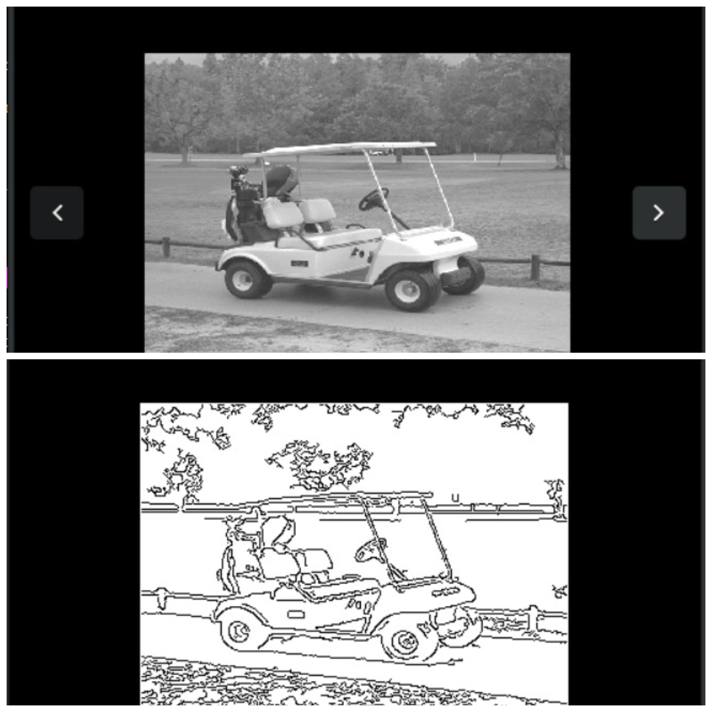
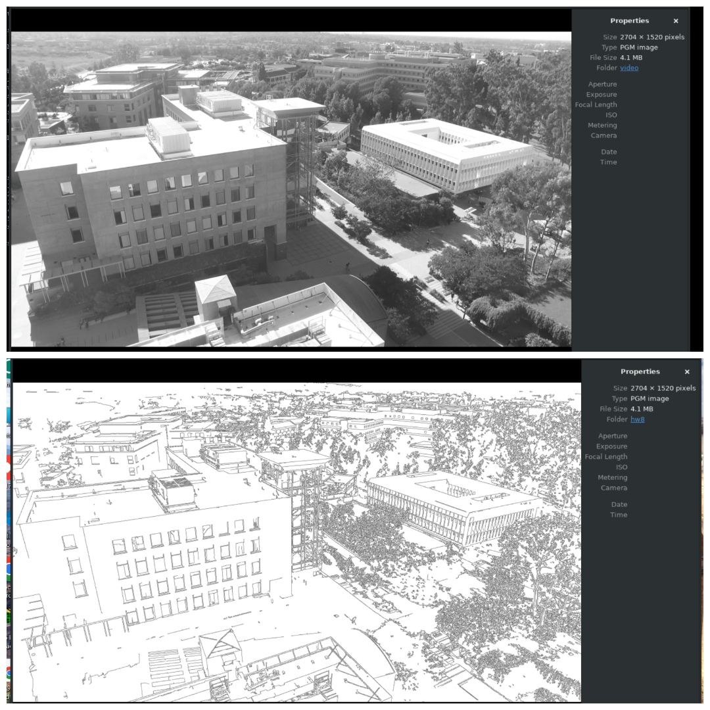

# Canny-Edge-Detector-
This repository contains a C++ implementation of the Canny edge detection algorithm to detect a wide range of edges in images while minimizing noise.Features Gaussian Smoothing, Gradient Calculation, Non-Maximal Suppression, Double Thresholding, Edge Tracking by Hysteresis.

## Objectives
- Implement the Canny edge detection algorithm in C++.
- Process a PGM image to identify and highlight edges.
- Compare the original and processed images to evaluate edge detection.

## Code Explanation

### Main Components
- **Gaussian Smoothing**: Reduces noise in the image using a Gaussian filter.
- **Gradient Calculation**: Computes the gradient magnitude and direction for edge detection.
- **Non-Maximal Suppression**: Thins out edges by keeping only local maxima.
- **Hysteresis Thresholding**: Identifies strong edges and traces weak edges connected to strong ones.

### Key Functions
- `gaussian_smooth()`: Applies Gaussian blur to the image to minimize noise.
- `derrivative_x_y()`: Computes the image gradients in the x and y directions.
- `magnitude_x_y()`: Calculates the magnitude of the gradient at each pixel.
- `non_max_supp()`: Suppresses non-maximum gradient values to thin edges.
- `apply_hysteresis()`: Uses double thresholding to finalize edge detection.

### Workflow
1. **Image Loading**: Reads a PGM image file (`golfcart.pgm`).
2. **Edge Detection**: Applies the Canny edge detection algorithm.
3. **Image Saving**: Writes the edge-detected image to a new PGM file.
## Images
Below are the images demonstrating the original input and the edge-detected output using the Canny edge detection algorithm.

## SystemC Modification

This section provides a detailed report on the implementation and execution of the Canny edge detection algorithm with timing instrumentation using SystemC. The primary objective was to measure the execution time of each major component of the algorithm and report the results.

### Why SystemC?
The code was modified to SystemC to facilitate detailed performance analysis and timing instrumentation, which is crucial for understanding execution efficiency and optimizing the algorithm for better performance.

## Canny Edge Detection SystemC Code Explanation

This C code implements the Canny edge detection algorithm, which is a multi-stage process used to detect edges in images. The code processes a series of images, applies the Canny edge detection, and measures the execution time of each major component for performance analysis.

### Key Components

- **Image I/O**: 
  - `read_pgm_image()`: Reads images in PGM format.
  - `write_pgm_image()`: Writes images in PGM format.

- **Canny Edge Detection**:
  - `canny()`: Main function that coordinates the edge detection process.
    - **Gaussian Smoothing**: `gaussian_smooth()` applies a Gaussian filter to reduce noise in the image.
    - **Gradient Calculation**: `derivative_x_y()` computes the image gradients in the x and y directions.
    - **Magnitude Calculation**: `magnitude_x_y()` calculates the magnitude of the gradient.
    - **Non-Maximal Suppression**: `non_max_supp()` thins the edges by suppressing non-maximal gradient values.
    - **Hysteresis Thresholding**: `apply_hysteresis()` finalizes edge detection using double thresholding.

- **Performance Measurement**: 
  - The code uses `clock()` to measure the execution time of each function, providing insights into the performance of each stage of the algorithm.

### Workflow

1. **Initialization**: Sets up image arrays and file names for processing.
2. **Image Processing Loop**: Iterates over a series of images, applying the Canny edge detection algorithm.
3. **Timing and Reporting**: Measures and prints the execution time for each function, helping to identify bottlenecks and optimize performance.

### Purpose

The code is designed to efficiently process multiple images, simulating a video stream, and to provide detailed performance metrics for each stage of the Canny edge detection algorithm. This information is valuable for optimizing the algorithm and achieving real-time processing speeds.

## Efforts and Challenges

During the implementation of the Canny edge detection algorithm in SystemC, the following steps were undertaken:

1. **Instrumentation**: Timing code was added to measure the execution time of key functions such as `make_gaussian_kernel`, `blurX`, `blurY`, `gaussian_smooth`, `derivative_x_y`, `magnitude_x_y`, `non_max_supp`, and `apply_hysteresis`.

2. **Testing**: The algorithm was tested on a series of images (Engineering001.pgm to Engineering030.pgm) to ensure accuracy and performance.

3. **Optimization**: Efforts were made to optimize the code for better performance while maintaining accuracy.

### Challenges Encountered

- **Timing Accuracy**: Ensuring that the timing measurements were accurate and did not interfere with the execution of the algorithm was a primary concern.
- **Scope Management**: Managing variable scopes and ensuring that timing variables were accessible across different functions required careful code organization.
- **Segmentation Faults**: Encountered segmentation faults due to insufficient stack size on the Raspberry Pi. This was addressed by increasing the stack size using appropriate system configuration commands.
- **Memory Management**: Efficiently handling large image data was challenging, and it was crucial to manage memory allocation and deallocation properly to avoid memory leaks.

## Further Optimization

The code was further optimized by running it with 15 different compiler flags to achieve the most efficient execution time. The goal was to reach a frame processing speed (FPS) of 30ms, which refers to the time taken to process one frame of an image in milliseconds. Achieving a lower FPS indicates faster processing and more efficient code execution.

## Timing Results

Here is the table of measurement results showing the total and average execution time for each function across 30 images:
| Function               | Total Time (secs) | Average Time (secs) |
|------------------------|-------------------|---------------------|
| `make_gaussian_kernel`  | 0.000152          | 0.000005            |
| `blurX`                 | 5.426746          | 0.180892            |
| `blurY`                 | 8.389991          | 0.279666            |
| `gaussian_smooth`       | 13.876310         | 0.462544            |
| `derivative_x_y`       | 2.124179          | 0.070806            |
| `magnitude_x_y`        | 1.807023          | 0.060234            |
| `non_max_supp`         | 3.875581          | 0.129186            |
| `apply_hysteresis`     | 4.212161          | 0.140405            |
| `canny`                | 26.027459         | 0.867582            |
### Edge Detected Image

This image is a result of applying the SystemC edge detection algorithm, effectively capturing the structural outlines of the Engineering Tower. The SystemC implementation provides precise control over timing and performance, making it suitable for applications requiring high efficiency and real-time processing capabilities.
